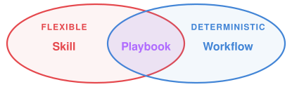

<!-- SPDX-License-Identifier: Apache-2.0 -->
<!-- SPDX-FileCopyrightText: 2026 SubLang International <https://sublang.ai> -->

# Playbook: Reliability Is All You Need

[](https://www.npmjs.com/package/@sublang/playbook)
[](https://nodejs.org/)
[](https://github.com/sublang-ai/playbook/actions/workflows/ci.yml)

_Skills made reliable through state machines and diverse LLMs._

Natural-language skills are flexible and easy to use, but less predictable than scripted workflows, especially on long-horizon jobs.
And even the best LLMs make mistakes, partly because plain-language descriptions rarely eliminate vagueness or guarantee completeness.

SubLang Playbook addresses both:

- The companion [SLC compiler](https://github.com/sublang-ai/slc) turns plain-language procedures, such as a `SKILL.md`, into playbooks with deterministic state-machine control flow.
- A playbook can assign different agents or LLMs to its steps and have them review and challenge one another, helping catch mistakes before delivery.



Vocabulary: the **Boss** is you; the **Captain** is the coordinating agent you
talk to; a **role** is a playbook-local job such as `coder`; and a **player** is
a stable Captain-session agent and provider conversation to which one or more
roles bind. Roles describe the workflow, while player IDs decide which work
shares conversation continuity.

Run `playbook` for an interactive tmux UI powered by [cligent](https://github.com/sublang-ai/cligent), or `playbook run` for the same Captain session without tmux in scripts and CI.

## Quick start

Out of the box, Playbook includes **CODE** for implementation, **REVIEW** for commit-based review and fixes, and **DECIDE** for independently proposed and reviewed specification decisions.
CODE and DECIDE call REVIEW as a nested playbook.

The shared starter config uses Claude as both Captain and the `dev.coder`
player, and Codex as `dev.reviewer`. CODE, REVIEW, and DECIDE bind their local
roles explicitly to those two stable players, so nested and later engagements
share a conversation only where their bindings name the same player ID.

```sh
npm install -g @sublang/playbook
npm install -g @anthropic-ai/claude-agent-sdk @openai/codex-sdk
```

Custom configurations need the SDKs required by their providers; see [Configuring agents](docs/configuration.md).
If an SDK is missing or older than cligent supports, Playbook prints the pinned install command before launching anything; see [Installing agent SDKs](docs/cli.md#installing-agent-sdks) for upgrades, `npx`, and other adapters.

Prerequisites:

- Node.js >= 20.6.0
- Authenticated [Claude Code](https://docs.anthropic.com/en/docs/claude-code/overview) or `ANTHROPIC_API_KEY`
- Authenticated [Codex CLI](https://github.com/openai/codex) or `OPENAI_API_KEY`

Interactive `playbook` additionally needs `tmux` and [`glow`](https://github.com/charmbracelet/glow#installation) on `PATH`; headless `playbook run` does not.

CODE works in the current directory and can edit and commit autonomously, so use a clean branch or worktree.

```sh
cd /path/to/your/project
playbook
```

Type a task, enter `/code <task>` for implementation, or enter
`/decide <question>` for an independently proposed and reviewed decision.

On first launch, Playbook writes its config to `${XDG_CONFIG_HOME:-$HOME/.config}/playbook/playbook.config.yaml`.

The same config, compiled Captain, enabled playbooks, stable players, and
nested calls power headless turns. Both front ends create the same durable
logical session: copy the reported session ID to reopen an interactive session
headlessly or a headless session interactively.
Run REVIEW explicitly, or pipe a longer request to Captain:

```sh
playbook run "/review review the latest commit"
printf '%s\n' 'Implement the approved specification, then review it.' | playbook run
# Later, either presentation can reopen the returned/reported session id:
playbook --session 4f2c0000-0000-4000-8000-000000009ab1
playbook run --session 4f2c0000-0000-4000-8000-000000009ab1 "continue"
```

`playbook run` prints the one Boss-visible Captain reply to stdout and operational status to stderr; CODE and DECIDE can complete their nested REVIEW calls there too.

See [Using the CLI](docs/cli.md) for flags and durable continuation, [Configuring agents](docs/configuration.md) for the shared lineup, [Embedding](docs/embedding.md) for custom hosts, and the [changelog](CHANGELOG.md) for releases.

## Create your own playbook

The separate [SLC compiler](https://github.com/sublang-ai/slc) requires Node.js >= 23.6 and compiles a plain-language `.md` or `.txt` procedure:

```sh
npm install -g @sublang/slc
slc playbook my-workflow.md
# After enabling /absolute/path/to/my-workflow.ts in the shared config:
playbook run "/my-workflow <your task>"
```

SLC writes `my-workflow.ts`, a registry entry ready for Playbook, beside the source, and the inspectable intermediates and tests under `my-workflow.playbook/`.
Enable that entry and bind each role it declares under `playbooks.my-workflow` in the shared config, then invoke `/my-workflow`; see [External playbooks](docs/configuration.md#external-playbooks) and the [SLC documentation](https://github.com/sublang-ai/slc#quick-start).

## How it compiles

SLC's `playbook` pipeline has three phases:

1. **text → GEARS** ([slc/text2gears.md](slc/text2gears.md)) — makes each behavior explicit with its trigger, actor, prompt, and outcomes.
2. **GEARS → FSM** ([slc/gears2fsm.md](slc/gears2fsm.md)) — maps each item to an XState state that invokes the Captain, a player, another playbook, or a local script.
3. **FSM → runtime** ([slc/link.md](slc/link.md)) — links the machine to a host-independent interface for user input, agent calls, status, and telemetry.

The default [optimization pass](slc/optimize.md) replaces eligible mechanical steps with local shell scripts; `--no-optimize` skips it.
Inspect the complete [Captain](reference/sdlc/captain.md), [CODE](reference/sdlc/code.md), [REVIEW](reference/sdlc/review.md), and [DECIDE](reference/sdlc/decide.md) examples.

## Contributing

We welcome contributions of all kinds.

- 🌟 Star our repo if you find Playbook useful.
- [Open an issue](https://github.com/sublang-ai/playbook/issues) for bugs or feature requests.
- [Open a PR](https://github.com/sublang-ai/playbook/pulls) for fixes or improvements.
- Discuss on [Discord](https://discord.gg/XxTPjNqy9g) for support or new ideas.

From source:

```sh
git clone https://github.com/sublang-ai/playbook.git
cd playbook
pnpm install --frozen-lockfile
pnpm build
pnpm test
pnpm playbook   # drive a Boss turn against the source tree
```

Playbook is itself spec-driven: the compiler phases are specs in [`slc/`](slc), and the reference playbooks are regenerated from their prose sources.
Edit a source, regenerate its GEARS, FSM, and runtime artifacts, sync the tests and downstream specs until `pnpm test` passes, and commit with co-author trailers per [`specs/packages/git.md`](specs/packages/git.md).
The gears↔FSM contract ([the playbook package](specs/packages/playbook.md)) and runtime contract ([the playbook-runtime package](specs/packages/playbook-runtime.md)) are pinned in [`specs/packages/`](specs/packages) and verified by the test suite.

## License

[Apache-2.0](LICENSE)
